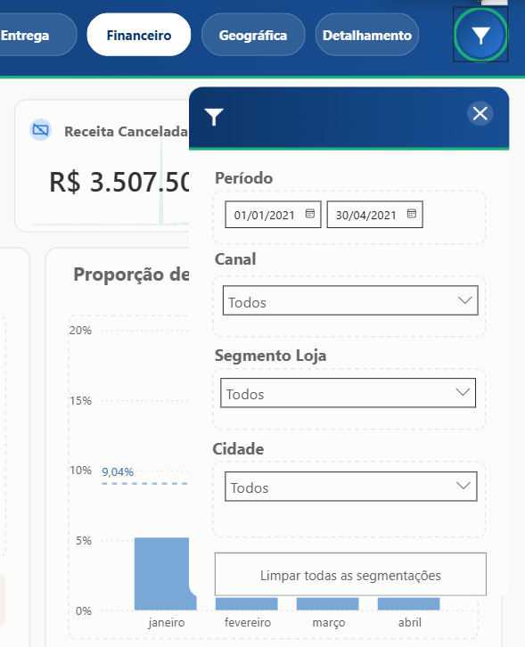
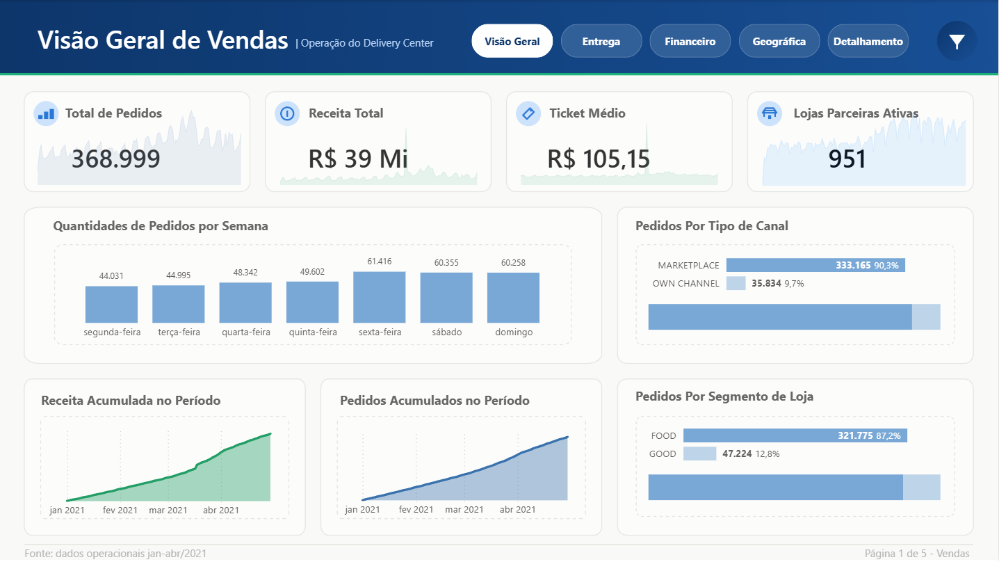
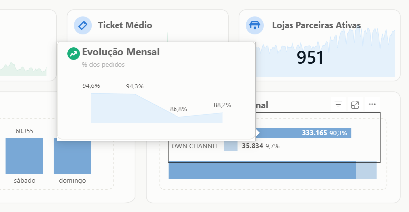
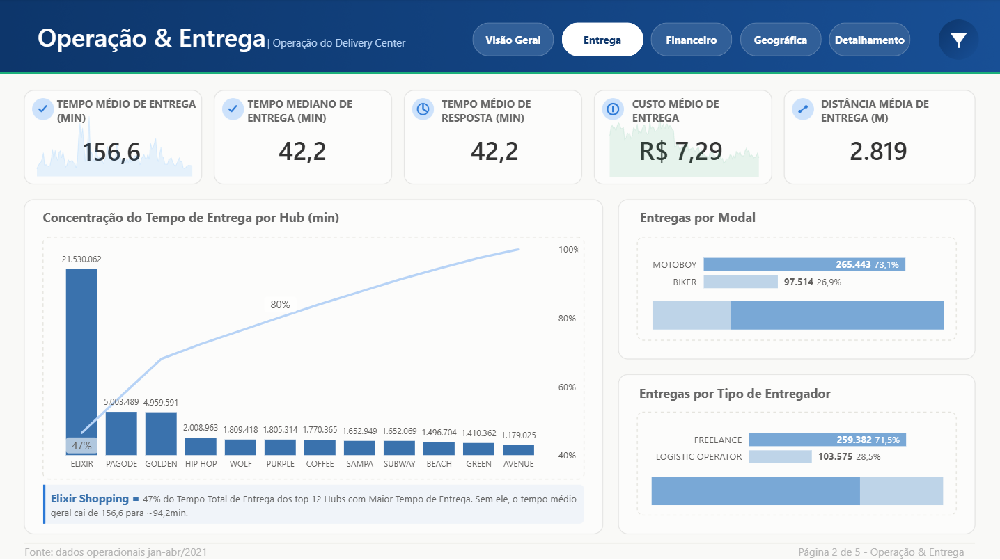
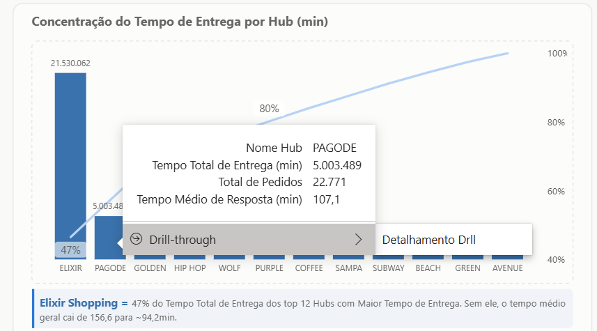
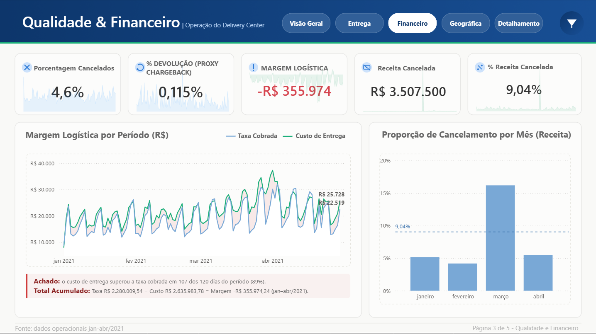
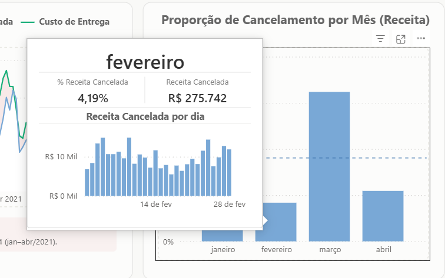
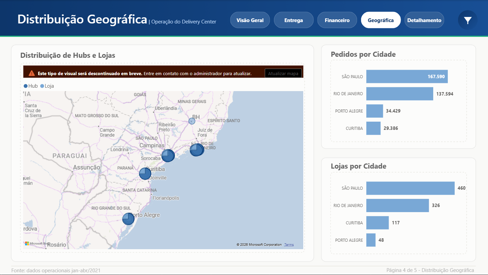
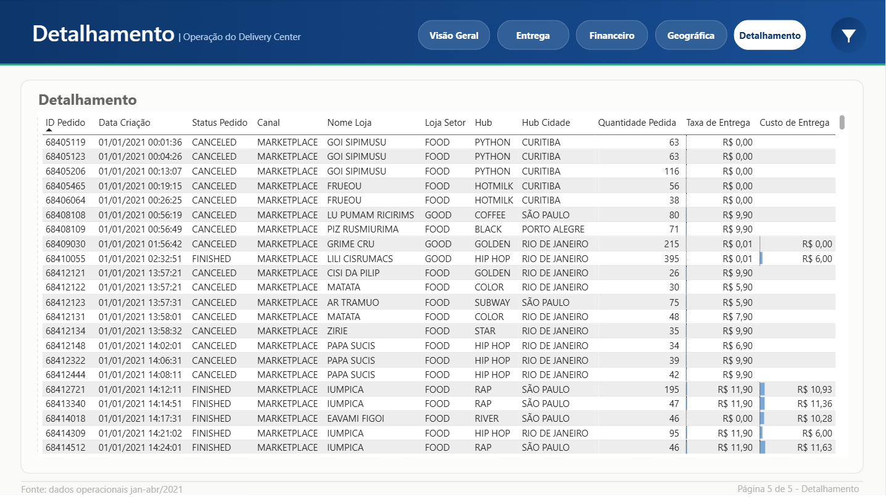

# Delivery Center — Dashboard de Operação (BI)

*[Read in English](README.md)*

Dashboard em Power BI construído a partir do case "Delivery Center" — um case público de prática de BI que simula a operação de uma plataforma de delivery que conecta lojas/restaurantes e marketplaces através de hubs regionais de distribuição. O dataset é fictício/embaralhado, não é dado real de cliente ou empresa.

O objetivo foi ir além de só montar o relatório: modelar os dados corretamente (Power Query + esquema estrela), calcular as métricas de negócio pedidas em DAX e **redesenhar a camada visual** — layout, cores, tooltips, painel de filtros — como entrega própria.

**[Protótipo navegável no Figma →](https://www.figma.com/proto/4ybE2H7eK4rPlueljGwlsF/OPERA%C3%87%C3%83O-DO-DELIVERY-CENTER-%E2%80%93-CAIO-PRADO?node-id=1-627&p=f&viewport=-32%2C156%2C0.25&t=SFTmUkSk5FtjkSHh-1&scaling=min-zoom&content-scaling=fixed&page-id=0%3A1)**

**[Post no LinkedIn →](https://www.linkedin.com/feed/update/urn:li:ugcPost:7484364847732908032/)**

## Stack

`Power BI Desktop` · `Power Query (M)` · `DAX` · `Figma` (design visual)

## Passeio pelas telas

Página por página — não só o que cada visual mostra, mas o achado de negócio que ela deixa visível.

### Painel de filtros global

Uma camada flutuante acessível de qualquer aba pelo ícone de funil, com **período, canal, segmento de loja e cidade** como cortes. Um único conjunto de segmentações reaplicado em todas as 5 páginas faz o analista trocar o corte uma vez e ver KPIs, gráficos, mapa e tabela reagirem juntos, sem duplicar visuais por canal ou cidade.

### Visão geral de vendas

- **368.999** pedidos, **R$ 39 Mi** em receita, ticket médio de **R$ 105,15**, **951** lojas ativas — o quarteto que qualquer diretoria pede primeiro.
- Sazonalidade semanal clara: pedidos sobem de **44 mil** na segunda para **61 mil** na sexta, um salto de ~40% — a operação claramente pulsa com o fim de semana.
- Dependência forte de marketplace: **90,3%** dos pedidos vêm de canais terceiros contra **9,7%** de canal próprio.

> **Achado no tooltip:** o card de Ticket Médio esconde uma tendência — o **% de pedidos dentro do prazo caiu de 94,6% para 88,2%** ao longo dos 4 meses. Nenhum KPI da capa mostra isso; só aparece ao passar o mouse, o tipo de sinal que se perde se o relatório só tiver números grandes na tela.

### Operação e entrega

- Tempo médio de entrega de **156,6 min** contra uma mediana de só **42,2 min** — a média muito acima da mediana já denuncia outliers puxando o número pra cima.
- Frota é majoritariamente motoboy (**73,1%**) e freelancer (**71,5%**) — a operação depende de mão de obra informal, não de frota própria fixa.

> **Achado no gráfico de concentração:** o Pareto por hub mostra que **Elixir Shopping sozinho responde por 47%** do tempo total de entrega entre os 12 hubs com maior tempo total de entrega. Tirando esse hub da conta, o tempo médio geral cai de **156,6 para ~94,2 min** — ou seja, o problema de entrega não é generalizado, está concentrado num ponto específico da rede. E o tooltip já entrega o drillthrough pra ir direto ao detalhe daquele hub, sem sair da página.

### Qualidade e financeiro

- Cancelamento em **4,6%** e devolução (proxy chargeback) em apenas **0,115%** — o cancelamento é o ponto de atrito real, a devolução quase não acontece.
- Março se destaca com cancelamento de receita perto de **16%**, bem acima da média de **9,04%** do período.

> **Achado na margem logística:** a linha de custo de entrega fica **acima** da linha de taxa cobrada em **107 dos 120 dias (89%)** do período, fechando o quadrimestre em **-R$ 355.974** de margem logística. Em outras palavras: a operação de entrega perde dinheiro na maioria dos dias — não é um mês ruim isolado, é o padrão.

### Distribuição geográfica

- Rede concentrada no Sul/Sudeste: São Paulo, Rio de Janeiro, Curitiba, Porto Alegre e um hub menor em BH.
- São Paulo lidera nos dois lados — **167.590** pedidos e **460** lojas — demanda e oferta crescendo juntas.

> **Achado no comparativo por cidade:** Rio de Janeiro é a 2ª cidade em pedidos (**137.594**) mas concentra **326** lojas — uma razão pedido/loja mais alta que Curitiba ou Porto Alegre. É o tipo de leitura que vira pergunta de expansão: será que a malha de lojas do RJ está mais enxuta que o esperado pro tamanho da demanda, e Curitiba/Porto Alegre já têm loja de sobra pro que vendem?

### Detalhamento por pedido (drillthrough)

A última página é a tabela crua, pedido a pedido — canal, loja, hub, quantidade, taxa de entrega e custo de entrega lado a lado.

> **Pra que serve essa página:** é aqui que qualquer KPI das páginas anteriores pode ser auditado até a linha original — por exemplo, confirmar por que um pedido **CANCELED** ainda registra custo de entrega (o entregador já tinha sido despachado antes do cancelamento cair no sistema), o tipo de caso que explica na prática por que a margem logística fecha negativa.

**Três achados que os números soltos não mostrariam:**
1. O tempo de entrega "ruim" está concentrado num hub (Elixir Shopping), não distribuído pela rede toda.
2. A operação de entrega perde dinheiro na maioria dos dias do período — a taxa cobrada não cobre o custo real.
3. Demanda e oferta de lojas não crescem na mesma proporção em todas as cidades, o que é insumo direto pra decisão de expansão.

## Modelo de dados

Esquema estrela construído a partir de 7 tabelas de origem:

- **Tabelas fato**: `orders` (timestamps do ciclo do pedido, valor, taxa/custo de entrega), `deliveries` (distância, status), `payments` (valor, taxa, método)
- **Tabelas dimensão**: `stores`, `hubs`, `channels`, `drivers`

Os relacionamentos ligam pedidos a lojas/canais, entregas a entregadores e lojas a hubs, permitindo análise desde o detalhe do pedido até o agregado por hub/cidade.

## KPIs entregues

- Total de pedidos por período, pedidos por dia da semana
- Receita total, ticket médio
- Tempo médio de entrega, tempo médio de resposta do entregador
- % de pedidos entregues no prazo
- % de pedidos cancelados, % de devolução
- Lojas/restaurantes parceiros ativos
- Custo médio de entrega
- Cidades com maior demanda
- Produtos mais pedidos (quantidade)
- Pedidos por tipo de canal e segmento de loja

## Abrindo o relatório

Baixe **[delivery-center-operation-caio-prado.pbix](delivery-center-operation-caio-prado.pbix)** e abra com o **Power BI Desktop** (o GitHub não renderiza preview de `.pbix` — use os screenshots ou o protótipo do Figma acima pra uma visão rápida).
